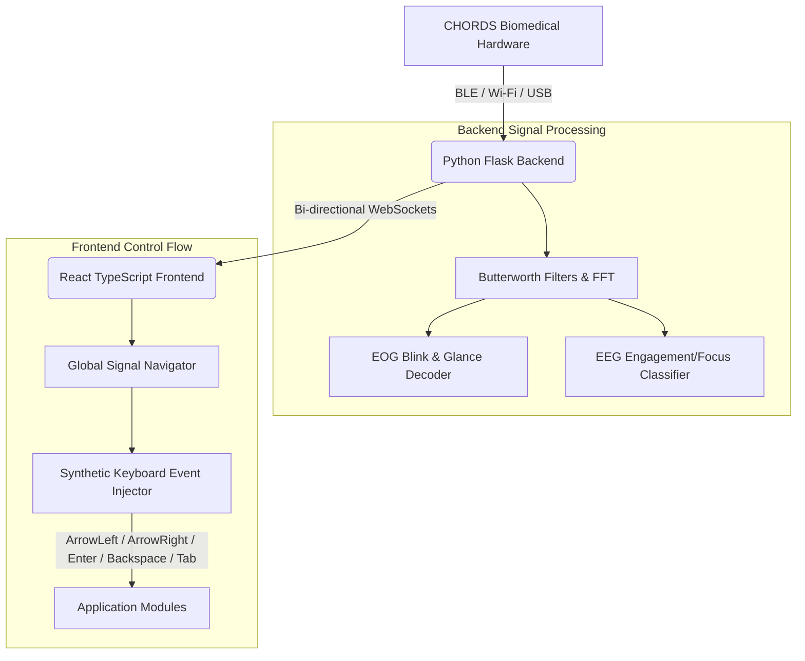

# NeuroAssist: Assistive Brain-Computer Interface (BCI) & EOG Controller

NeuroAssist is a state-of-the-art assistive communication and control platform designed to empower individuals with limited motor functions. By capturing and decoding raw electrophysiological signals—specifically eye movements via **Electrooculogram (EOG)** and brain activity via **Electroencephalogram (EEG)**—NeuroAssist maps user signals to virtual keyboard events, enabling full hands-free control of communications, smart home hardware, and media streaming.

The system interfaces with **CHORDS (NPG/BioAmp)** biomedical hardware via **BLE**, **Wi-Fi**, or **USB Serial**, streaming biological data in real-time.

---

## 🏗️ System Architecture

NeuroAssist utilizes a **decoupled, event-driven design** consisting of three main layers:



1. **Hardware & Streaming Interface**: The connection manager coordinates data streams from the sensor array, optionally broadcasting to Lab Streaming Layer (LSL) outlets for research and saving records to CSV files.
2. **Signal Processing & Classifier (Backend)**: The Flask backend applies real-time notch and bandpass filtering, extracts frequency power bands, tracks signal envelopes, and runs event detection.
3. **Application Dashboard & Event Injection (Frontend)**: The React app connects to the backend via Socket.IO. The `GlobalSignalNavigator` translates bio-events into standard, synthetic keyboard keys (`ArrowLeft`, `ArrowRight`, `Enter`, `Backspace`, `Tab`), making individual application modules completely control-agnostic.

---

## 📁 Repository Directory Structure

```
├── main app/
│   ├── backend/
│   │   ├── connection/               # BLE, Wi-Fi, and USB device communication handlers
│   │   ├── signal_processing/        # Filter algorithms and feature extraction
│   │   │   ├── eeg.py                # Power band calculation & Focus classifier
│   │   │   └── eog.py                # Blink envelope & glance deviation detector
│   │   ├── app.py                    # Flask server & Socket.IO server
│   │   ├── db.py                     # SQLite controller for contacts & chat history
│   │   ├── prediction.py             # Word Completion and Prediction engine
│   │   ├── telegram_service.py       # Telegram Bot integration & long-polling loop
│   │   └── neuroassist.db            # SQLite database file
│   │
│   └── frontend/
│       ├── src/
│       │   ├── components/           # UI elements (Signal Monitor, Conn Panel, Morse tree)
│       │   ├── hooks/                # Keyboard event injectors
│       │   ├── pages/                # App Views (Typing speller, Telegram chats, YouTube Shorts, IoT)
│       │   ├── services/             # Zustand state management & Socket service
│       │   └── index.css             # CSS and Tailwind configuration
│       │
│       ├── package.json              # React dependencies & scripts
│       └── vite.config.ts            # Vite compile options
│
├── morsefixed.py                     # Standalone legacy Tkinter-based Morse EOG decoder
└── README.md                         # Project documentation
```

---

## 🌟 Core Features

### 1. Communication Dashboard (Morse Tree Speller)
- **Visual Morse Navigation**: Users steer a binary decision character tree (Morse structure) using horizontal glances.
  - 👀 **Look LEFT**: Navigate left in the tree (Dot `.` in Morse logic).
  - 👀 **Look RIGHT**: Navigate right in the tree (Dash `-` in Morse logic).
- **Triggers**:
  - 😉😉 **Double Blink** (`ENTER` key): Selects the highlighted character, adds it to the text editor, and resets navigation to the tree root.
  - 😉😉😉 **Triple Blink** (`BACKSPACE` key): Clears current path (if navigating) or deletes the last letter (if at the root).
- **Action Menu**: Double-blinking at the root node opens a modal allowing the user to either **Send** the composed text via Telegram or **Clear** the editor.

### 2. Smart Word Prediction
- **Focus-Driven Completions**: When the user concentrates, their EEG signals transition the interface to **Prediction Mode** (`Tab` key).
- **Wordfreq Engine**: Integrates the `wordfreq` package (with a localized backup dictionary) to search millions of English word frequencies.
- Suggestions dynamically predict the current word or suggest logical next words. Glancing left or right scrolls and selects words from the strip.

### 3. Full Telegram Client Integration
- Displays contact lists and live messaging threads stored in a local SQLite database (`neuroassist.db`).
- A background polling thread listens for incoming messages via the **Telegram Bot API**, saving them to the database and piping them live to the React UI via WebSockets.
- Direct reply actions tie straight into the Morse keyboard for seamless chatting.

### 4. Smart Home Controller (IoT Mockup)
- An eye-controlled control panel allowing users to toggle smart home appliances (Lights, Fans, Air Conditioners, Security systems).
- Fully navigable using EOG glances and selection blinks.

### 5. YouTube Shorts Navigator
- Provides hands-free browsing of video content.
- Users can scroll to the next video, pause, like, or navigate back using eye gestures.

### 6. Emergency Alerts
- Triggered instantly to sound a local audio alarm and blast emergency alert messages containing pre-set SOS alerts to pre-defined Telegram contacts.

---

## 🔬 Signal Processing & Classifiers

### Electrooculography (EOG)
- **Filtering Pipeline**: Raw horizontal and vertical channel inputs are centered and processed through:
  - 2nd-order **Notch Filter** (50Hz powerline noise suppression).
  - 2nd-order **High-Pass filter** (1Hz cutoff to remove baseline drift).
  - 2nd-order **Low-Pass filter** (10Hz cutoff to smooth out muscular high-frequency artifacts).
- **Blink Envelope Detection**: Vertical signal passes through a 100ms moving-average envelope detector. When the envelope exceeds a configurable threshold, it registers a blink.
- **Glance Direction & Overshoot Suppression**: Glances are detected when horizontal signal deviations exceed the calibration threshold.
  - *Overshoot Suppression*: To avoid triggering a false "rebound glance" in the opposite direction when eyes return to the center, a **500ms block** is applied to the opposite direction immediately after glance release.

### Electroencephalography (EEG)
- **Spectral Decomposition**: Raw EEG data is windowed (Hanning window) and transformed into the frequency domain using Fast Fourier Transform (FFT).
- **Power Bands Evaluated**:
  - Delta ($\delta$): 0.5 - 4 Hz
  - Theta ($\theta$): 4 - 8 Hz
  - Alpha ($\alpha$): 8 - 13 Hz
  - Beta ($\beta$): 13 - 30 Hz
  - Gamma ($\gamma$): 30 - 45 Hz
- **BCI Engagement Index**: Computed as:
  $$\text{Engagement Ratio} = \frac{\text{Beta Power} + \text{Gamma Power}}{\text{Theta Power} + \text{Alpha Power}}$$
- **Leaky Bucket Classifier**: A continuous focus timer bucket charges when the engagement index exceeds a dynamic threshold and leaks when it falls below baseline. Sustained focus of **2.5 seconds** triggers the `FOCUSED` transition (mode-toggle).
- **Dynamic Thresholding**: The backend continuously monitors relaxed state baselines to automatically calibrate $Threshold_{high}$ (Mean + 0.5 * StdDev) and $Threshold_{low}$ (Mean).

---

## 🛠️ Installation & Setup

### Prerequisites
- Python 3.8 or higher
- Node.js (v16.0 or higher) and npm
- A Telegram Bot Token (generated via [@BotFather](https://t.me/BotFather) on Telegram)

### 1. Backend Configuration
1. Open a terminal and navigate to the backend folder:
   ```powershell
   cd "main app/backend"
   ```
2. Create and activate a virtual environment:
   ```powershell
   python -m venv venv
   # On Windows:
   .\venv\Scripts\Activate.ps1
   # On macOS/Linux:
   source venv/bin/activate
   ```
3. Install the required Python packages:
   ```powershell
   pip install -r requirements.txt
   ```
4. Create a `.env` file in the `main app/backend/` directory:
   ```env
   TELEGRAM_BOT_TOKEN=your_telegram_bot_token_here
   ```
5. Launch the backend Socket.IO and Flask service:
   ```powershell
   python app.py
   ```
   *The backend will boot up at `http://localhost:5000`.*

### 2. Frontend Configuration
1. Open a new terminal and navigate to the frontend folder:
   ```powershell
   cd "main app/frontend"
   ```
2. Install the node dependencies:
   ```powershell
   npm install
   ```
3. Start the Vite React development server:
   ```powershell
   npm run dev
   ```
   *The interface will run on `http://localhost:5173`.*

---

## 💻 Offline Standalone Speller (`morsefixed.py`)

If you want to run a standalone, desktop-native Morse-code speller without launching the full web stack:
- Navigate to the repository root directory.
- Open a terminal and run:
  ```powershell
  python morsefixed.py
  ```
- This Tkinter GUI searches for and binds directly to a **Lab Streaming Layer (LSL)** stream.
- Provides graphical calibration tools, draggable detection threshold boundaries, visual envelope meters, and decodes Morse letters inside the GUI application.
